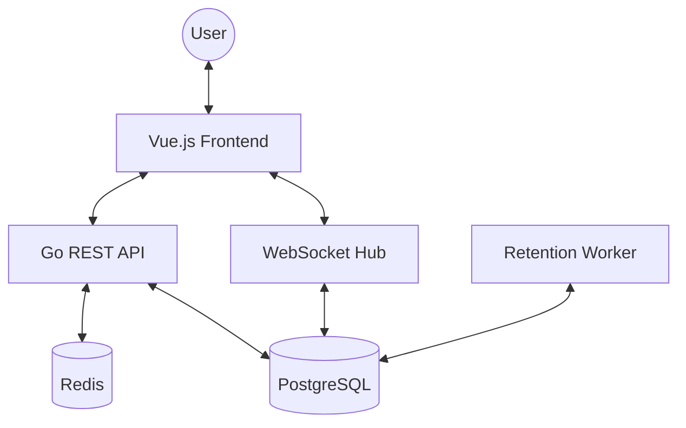

# Architecture Overview

Bulletin is designed as a decoupled monorepo with a Go backend and a Vue.js frontend, optimized for a nimble development experience.

## System Diagram

## Backend Components

### REST API (`/api`)

Handles authentication, circle management, and post retrieval. Features include:

- **Membership Middleware**: Verifies user access for every circle-scoped request.
- **Recursive CTEs**: Efficiently fetches deep conversation trees and aggregated thread statistics in a single query.
- **Session Auth**: Secure cookies with database-backed persistence.

### WebSocket Hub

Manages real-time communication. Features:

- **Presence Tracking**: Real-time join/leave broadcasts.
- **Concurrency**: Thread-safe client management using Go channels and Mutexes.
- **Message Types**: Supports `chat`, `join`, `leave`, and `presence` payloads.

### Background Workers

- **Chat Retention Worker**: Runs hourly to purge messages based on per-circle expiration rules.
- **Migration Runner**: Automatically applies SQL schema updates on startup.

## Frontend Components

### State Management (Pinia)

- `auth`: Global authentication state and profile updates.
- `circles`: Comprehensive store for circle data, threads, tags, and members.
- **`toast`**: Custom notification system for non-blocking UI feedback.

### UI Components

- **`ThreadNode`**: A recursive component designed to render deeply nested conversations with inline reply support.
- **`ToastContainer`**: Global portal for animated success/error notifications.
- **View-based Errors**: Integrated states for `Access Denied` and `Not Found` that preserve navigation context.

## Development DX

- **Nimble Mode**: Infrastructure (DB/Cache) runs in Docker, while application logic runs natively on the host with live-reload support via `air` and Vite HMR.
