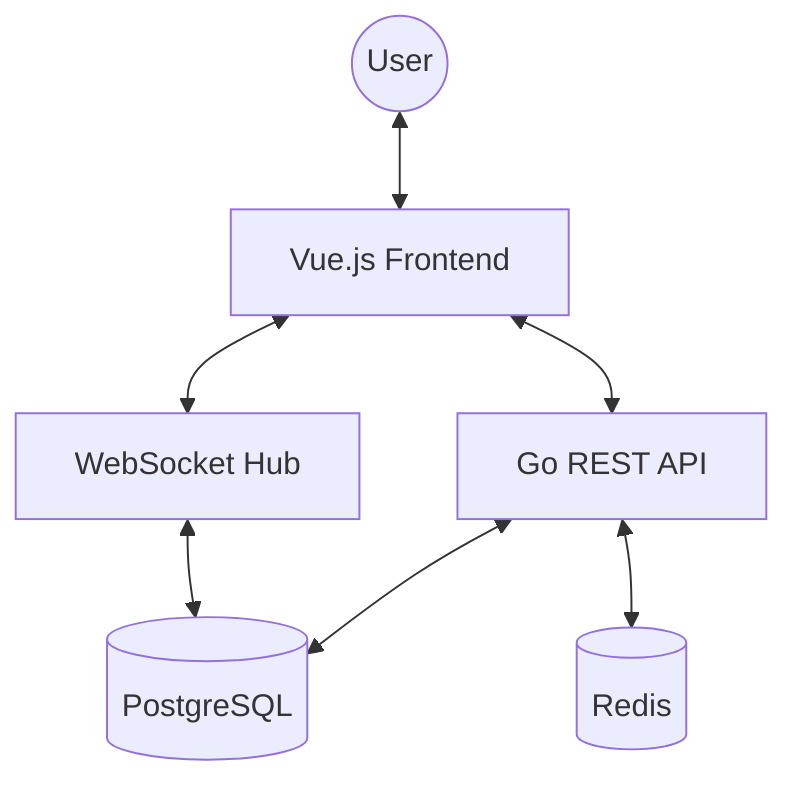

# Architecture Overview

Bulletin is designed as a decoupled monorepo with a Go backend and a Vue.js frontend.

## System Diagram

## Backend Components

### REST API (`/api`)
Handles authentication, circle management, and post retrieval. It uses session-based authentication via HTTP-only cookies.

### WebSocket Hub
Manages real-time chat rooms. Each circle has its own virtual "room" in the Go memory space. When a message is sent via WebSocket, it is:
1. Persisted to PostgreSQL.
2. Broadcast to all active connections in that circle.

### Background Workers
(Planned) Goroutines responsible for:
- Purging old chat messages based on circle retention settings.
- Cleaning up expired sessions.

## Frontend Components

### State Management (Pinia)
- `auth`: Stores user profile and login state.
- `circles`: Manages active circle data, posts, and chat history.

### Real-time Integration
The `CircleView` component establishes a WebSocket connection upon mounting and listeners for incoming messages to update the Pinia store in real-time.
