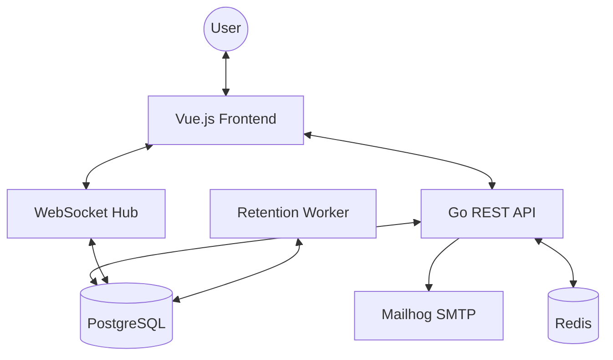

# Architecture Overview

Bulletin is designed as a decoupled monorepo with a Go backend and a Vue.js frontend, optimized for a nimble development experience.

## System Diagram

## Backend Components

### REST API (`/api`)

Handles authentication, circle management, and post retrieval. Features include:

- **Membership Middleware**: Verifies user access for every circle-scoped request.
- **Recursive CTEs**: Efficiently fetches deep conversation trees, aggregated thread statistics, and unread counts in single queries.
- **Session Auth**: Secure cookies with support for Multi-Factor Authentication (MFA) pending states.
- **Integrated Mailer**: SMTP client for sending verification and reset emails.

### WebSocket Hub

Manages real-time communication. Features:

- **Presence Tracking**: Real-time join/leave broadcasts.
- **Concurrency**: Thread-safe client management using Go channels and Mutexes.
- **Reactivity Hub**: Broadcasts chat messages which trigger instant unread counter updates in the frontend.

### Background Workers

- **Chat Retention Worker**: Runs hourly to purge messages based on per-circle expiration rules.
- **Migration Runner**: State-aware runner that tracks applied migrations in `schema_migrations`.

## Frontend Components

### State Management (Pinia)

- `auth`: Global authentication state and profile updates.
- `circles`: Comprehensive store for circle data, threads, tags, and members. Features intelligent background synchronization for unread counts.
- **`toast`**: Custom notification system for non-blocking UI feedback.

### UI Components

- **`ThreadNode`**: A recursive component designed to render deeply nested conversations with inline reply support and Markdown rendering.
- **`InviteModal`**: Reusable component for generating secure invitation codes with role-based access.
- **`ToastContainer`**: Global portal for animated success/error notifications.

### Navigation (Vue Router)

- **Nested Routing**: Every circle section (Chat, Dashboard, Search, Settings) has a unique URL, enabling browser history and deep-linking.
- **Auth Guards**: Navigation guards protect private routes and handle session re-hydration.

## Development DX

- **Nimble Mode**: Infrastructure (DB/Cache) runs in Docker, while application logic runs natively on the host with live-reload support via `air` and Vite HMR.
